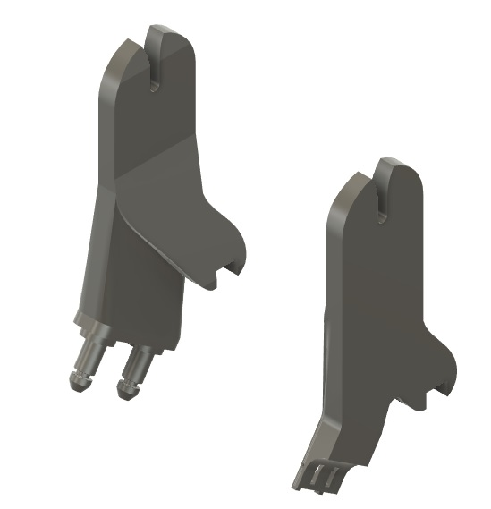
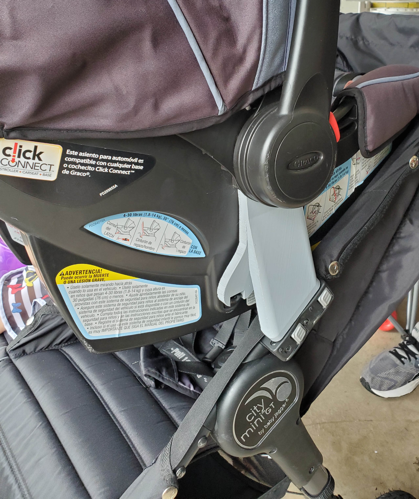

# Graco Car Seat to Citi Mini Double Stroller Adapter
Much to my wife's chagrin, when we bought the *perfect* double stroller in anticipation of a new arrival the carseat adapter we had was not compatible with the double version, just the single stroller.
Realizing she'd have to purchase new adapters she begrudgingly looked to her favorite online retailers only to discover that they were not only discontinued but completely unavailable save for a few offerings at more than the stroller itself costs!
I assured my skeptical wife that I and my 3D printer could solve this problem.
I found images of the adapters online and set out making measurements of the couplings to design my own adapters. After a number of failed attempts I finally got the dozen or so measurements accurate for the stroller connectors' unique shape.
I then set out to do the carseat connector which was much easier. I then did a loft to join the two components together (stroller and carseat) and exported the design to my slicer only to discover that, no matter how the design was rotated, it could not fit on my small printer!
I went back to squish and squeeze the design until finally it fit and I printed it. Success! It worked perfectly but it did not pass Q/A: "you are NOT putting my baby in that thing" (more or less). It wobbled a little too much and I will admit, it lacked the strength to safely hold a precious little one.
I then used both pins on the stroller for the connector and used a slicer modifier to have 100% infill at the crucial components. After these modifications, it finally got wife approval and was validated for use.

Note: While this works satisfactorily for my use, I know its limitations and you should too should you print it as well.

